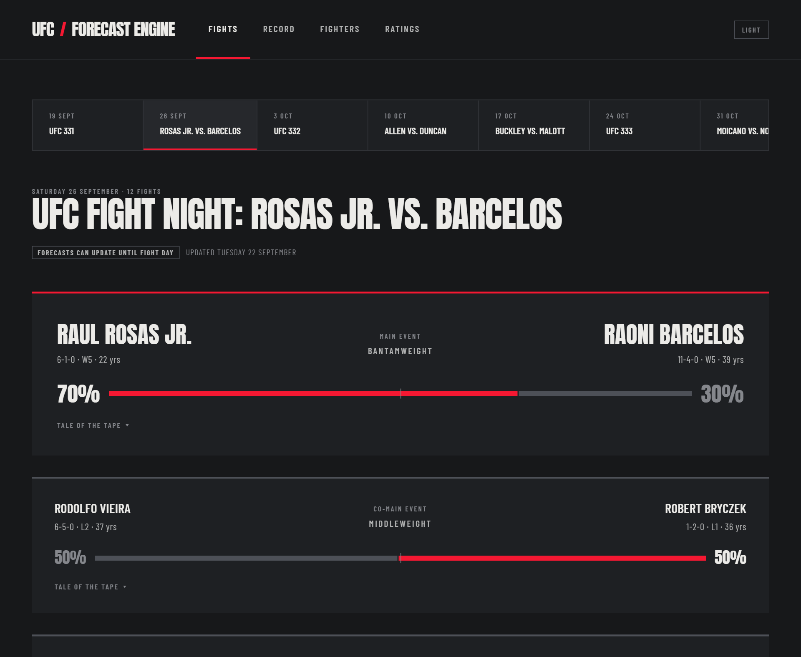
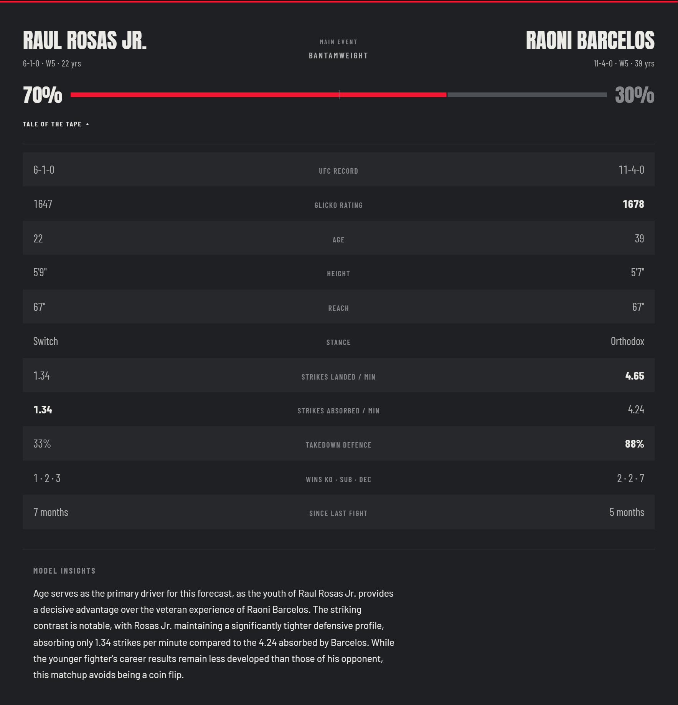
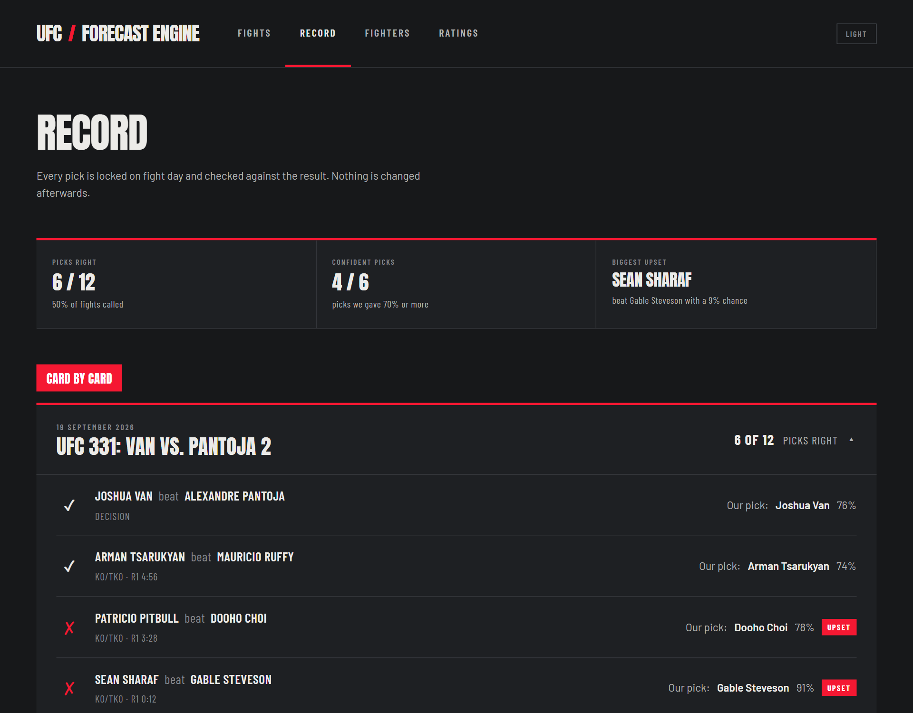
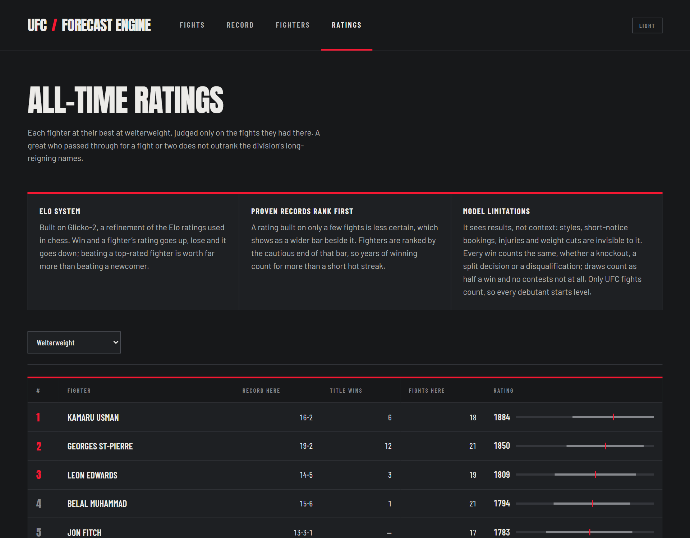
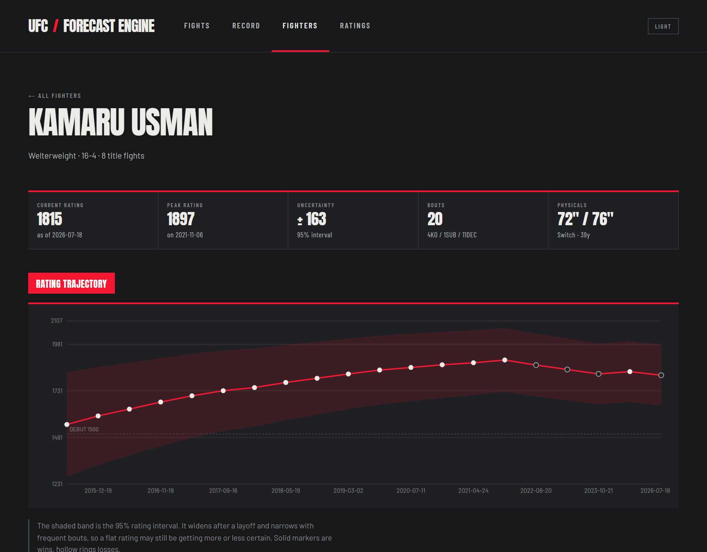
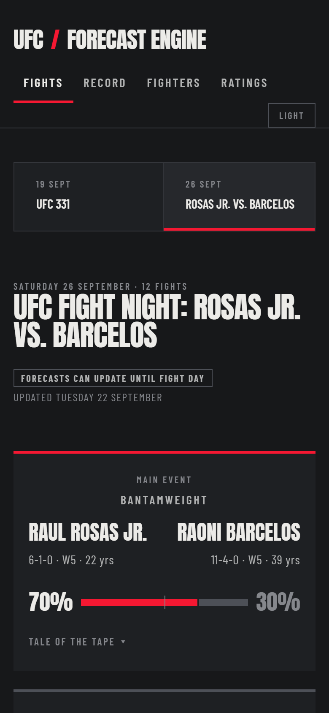

# UFC Forecast Engine

**Win probabilities for every upcoming UFC fight, locked before fight night and checked against the results.**

**Live site: [ufc-forecast-engine.pages.dev](https://ufc-forecast-engine.pages.dev)**



## What it is

Before every UFC event, the site gives each fight a forecast: how likely each
fighter is to win. Those forecasts are locked on fight day and checked against
what actually happened, so the site keeps an honest public record of its own
hits and misses. Nothing is edited after the fact.

Alongside the forecasts you can dig into any fighter's history, see how their
rating rose and fell over their career, and browse all-time ratings for every
division.

## How it works

- **It knows every UFC fight since 1994.** Nearly 9,000 fights and more than
  2,700 fighters, collected automatically, with the statistics from every fight.
- **It rates every fighter, like Elo in chess.** Win and a rating goes up, lose
  and it goes down; beating a top fighter counts for far more than beating a
  newcomer. The system also tracks how *sure* it is about each fighter.
- **It corrects for what ratings miss.** Age and striking style shift the odds in
  ways a rating alone can't see, so the forecast adjusts for them.
- **It explains itself.** Each fight comes with a short written read of the
  matchup, and every number in it is checked against the real statistics before
  it is published.
- **It runs itself.** Twice a week it collects new results, updates every rating,
  scores last weekend's forecasts, forecasts the next cards and republishes the
  site. No manual steps.

## Is it any good?

Before going live, the model was tested on seven years of fights it had never
seen (2019 to 2025, 3,482 fights). Its forecasts were measurably sharper than
flipping a coin and than the fighter ratings on their own. That is the promise;
the proof is the live record, which grows with every event. See the
**[Record page](https://ufc-forecast-engine.pages.dev/record)** for every pick so
far, right and wrong.

MMA is hard to predict: styles, injuries and short-notice fights are invisible to
any model, and upsets are part of the sport. The site says so plainly.

## A closer look



| The record | All-time ratings |
|---|---|
|  |  |

| A fighter's career | On a phone |
|---|---|
|  |  |

---

## Dev notes

The technical side: how the pieces fit, how the model was built and validated,
and how to run it yourself.

### Architecture

```
                 twice a week, on a schedule
  ┌─────────────────────────────────────────────────────────────────────┐
  │ scrape → ratings → history → forecast → narrate → publish           │
  │ ufcstats  Glicko-2   point-in-   locked     LLM        static JSON  │
  │ (browser) per bout   time state  forecasts  reads      + site → CDN │
  └─────────────────────────────────────────────────────────────────────┘
          PostgreSQL holds everything; the public site is static files
```

- **Scrape.** New events, bouts, per-fight statistics and fighter profiles from
  ufcstats.com, through a headless Chromium (the site blocks plain HTTP clients).
  The checkpoint lives in the database, so an event is fetched until every bout
  is stored, and never again after that.
- **Ratings.** Glicko-2, implemented from scratch and updated after every bout.
  Uncertainty grows while a fighter is out of the cage. A second replay runs
  inside each division, so a division's all-time list reflects only the work
  done there.
- **History.** Every bout is replayed in date order to record what each fighter
  had done *before* it. ufcstats publishes career totals; this gives the numbers
  as they stood going into each fight, which is what makes leakage-free features
  possible.
- **Forecast.** Every listed upcoming bout is scored by the frozen model and
  stored with the tale of the tape as it stood. Rows can update until fight day
  (US Eastern) and are locked from then on; results are scored after the event.
- **Narrate.** An LLM (Gemini) writes each fight's read from a fact sheet built
  only from stored data. Every number in the output must appear in the fact sheet,
  or the text is rejected and rewritten. The engine's internal factor weights are
  turned into words first and never shown.
- **Publish.** The site is read-only and only changes when the pipeline runs, so
  the public copy is static: every API response is exported as a JSON file
  (byte-identical to what the API serves) and uploaded with the built frontend to
  Cloudflare Pages. No server or hosted database is involved.

Health checks run after every refresh. A successful run pings healthchecks.io, which
alerts the owner when a scheduled run has not succeeded within its grace period.

### The forecasting model

```
logit P(A beats B) = b0 · logit(Glicko probability) + Σ b_i · (A_i − B_i)
```

- **Base rating:** its own Glicko-2 replay with shorter memory than the site's
  ratings, with constants tuned for forecasting by walk-forward log loss.
- **Corrections:** differences between the two fighters in what they had shown
  before the bout. Per-minute rates are shrunk toward the division average, so a
  debutant starts from a sensible prior rather than a blank.
- **Model:** L2 logistic regression with no intercept on antisymmetric inputs, so
  the two fighters' probabilities always sum to exactly 1.
- **Feature selection:** a group of features entered only if it improved
  out-of-sample log loss beyond bootstrap noise and every coefficient kept its
  sign across validation years. Of twelve candidate groups, **age** and
  **striking** passed; grappling, reach, layoff, experience, form and the rest
  did not.
- **No lookahead:** a truncation test rebuilds the features with history cut at a
  date and checks they match the full build exactly.

**Validation.** Walk-forward: train on everything before a year, test on that
year, for 2019–2025 (3,482 fights).

| | Log loss | Brier | AUC |
|---|---|---|---|
| Coin flip | 0.693 | 0.250 | 0.500 |
| Rating alone | 0.676 | 0.242 | 0.601 |
| **Rating + age + striking** | **0.652** | **0.230** | **0.661** |

The model is frozen as a JSON artifact in `models/`; inference is a dot product
and needs no ML library. Its forecasts since going live are the real test, and
the Record page keeps that record in full.

### Stack

Python 3.13 · PostgreSQL · Playwright · pandas / NumPy · scikit-learn · FastAPI ·
React 19 + Vite · Recharts · Gemini API · Cloudflare Pages · Docker · pytest

### Running it locally

Requirements: Python 3.13, PostgreSQL and Node 22.

1. `pip install -r requirements.txt`, then `python -m playwright install chromium`
   for the scraper's browser.
2. Copy `.env.example` to `.env` and fill in the database settings.
3. Build the data and run the site:

   ```
   python -m src.db                  # create the tables
   python -m src.refresh             # scrape, rate, replay, forecast (first run takes hours)
   cd frontend && npm install && npm run build && cd ..
   uvicorn src.api.main:app --port 8420
   ```

   Then open http://localhost:8420. For development with hot reload, run the API
   as above and `npm run dev` in `frontend/` (served on http://localhost:5180).
   On Windows, `scripts\dev.cmd` and `scripts\serve.cmd` do the same.

The written reads are optional: without `src/engine/voice.py` (private; see
`src/engine/voice.example.py`) and an API key, narration is skipped and the site
simply omits them. Publishing is skipped unless Cloudflare credentials are set.

**Tests.** `python -m pytest` runs the suite in about 20 seconds: Glicko-2 against
Glickman's published worked example, forecast symmetry, the narrator's fact check,
the scraper's parsers against saved ufcstats pages, connection-pool recovery,
every API route, and a check that the published files match the API exactly.
Tests that need the database skip themselves when it is unreachable.

**Deploying.** `python -m src.publish` builds the static site, exports the data
and uploads it to Cloudflare Pages (`--no-upload` to inspect it locally first). A
`Dockerfile` is also provided for running the site as a live API server instead,
configured by a single `DATABASE_URL`.

### Project layout

```
src/
  db.py              connection, pooling, schema, shared SQL
  scrape.py          ufcstats parsing, storage, incremental scrape
  ratings.py         Glicko-2, the site's ratings and per-division ratings
  history.py         point-in-time replay and snapshots
  refresh.py         the scheduled pipeline and its health checks
  publish.py         static export of every page's data, upload to Cloudflare Pages
  engine/
    features.py      the tuned rating and the correction features
    train.py         evaluation, rating tuning, feature selection, artifact
    predict.py       forecasting cards, locking, scoring
    narrate.py       the written match reads, with fact checks
  api/
    main.py          routes, and the server for the built frontend
    cards.py         fight cards, tale of the tape, the record
    queries.py       fighter and ratings queries
frontend/src/        React app: Fights, Record, Fighters, Ratings
models/              frozen model artifacts (JSON)
tests/               pytest suite; fixtures are saved ufcstats pages
docs/screenshots/    images used in this README
scripts/             Windows launchers: dev, serve, scheduled refresh
```

---

## Licence

[GNU Affero General Public License v3.0](LICENSE). You are free to use, study and
modify the code; if you run a modified version as a public service, you must
publish your changes under the same licence. The licence covers this code only,
not the fight data it collects.

## Disclaimer

Not affiliated with, endorsed by or sponsored by the UFC, Zuffa LLC or TKO Group
Holdings. UFC is a registered trademark of Zuffa LLC. Forecasts are for
entertainment only and are not betting advice. Fight data comes from
[ufcstats.com](http://www.ufcstats.com); this repository contains the code that
builds the dataset, not the dataset itself.
